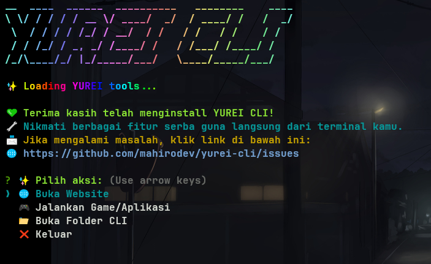
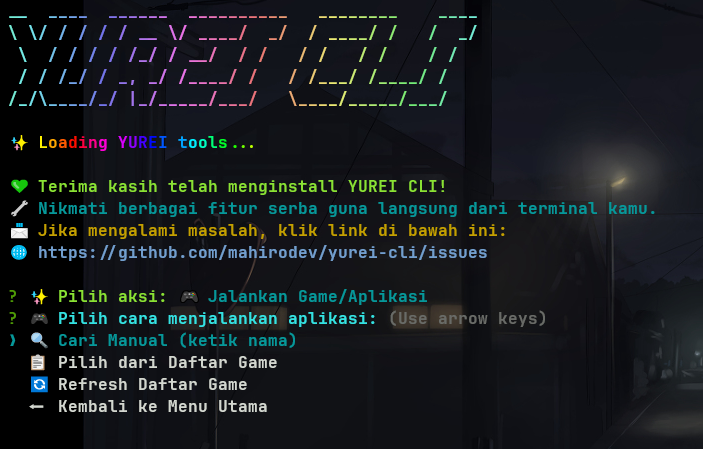
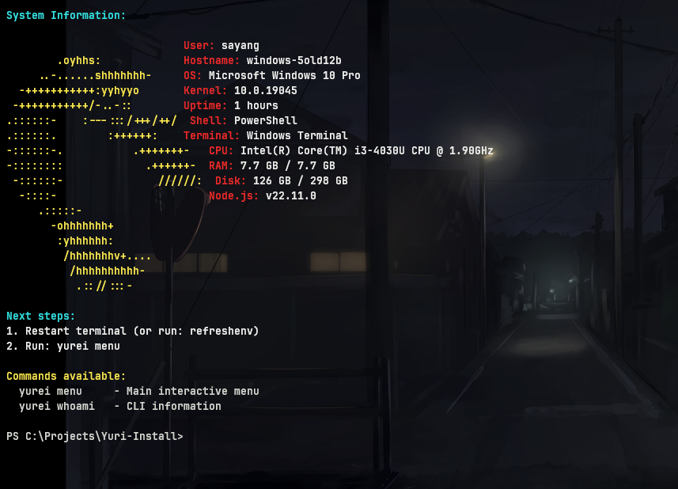

# 👻 Yurei CLI

<p align="center">
  <pre>
  ██╗   ██╗██╗   ██╗██████╗ ███████╗██╗████████╗ ██████╗  ██████╗ ██╗     ███████╗
  ██║   ██║██║   ██║██╔══██╗██╔════╝██║╚══██╔══╝██╔═══██╗██╔═══██╗██║     ██╔════╝
  ██║   ██║██║   ██║██████╔╝█████╗  ██║   ██║   ██║   ██║██║   ██║██║     █████╗  
  ╚██╗ ██╔╝██║   ██║██╔═══╝ ██╔══╝  ██║   ██║   ██║   ██║██║   ██║██║     ██╔══╝  
   ╚████╔╝ ╚██████╔╝██║     ███████╗██║   ██║   ╚██████╔╝╚██████╔╝███████╗███████╗
    ╚═══╝   ╚═════╝ ╚═╝     ╚══════╝╚═╝   ╚═╝    ╚═════╝  ╚═════╝ ╚══════╝╚══════╝
  </pre>
  <h3 align="center">Yurei CLI - Developer tool lokal serbaguna dengan sentuhan Jepang ✨</h3>
</p>

---

**Yurei** adalah CLI serbaguna buatan lokal. Siap membantu Anda membuka website, game, dan aplikasi langsung dari terminal—cepat, ringan, dan dapat dikustomisasi sesuai selera.

> 🌸 *"Jiwa developer modern tapi tetap oldschool."*

---
====================================================
### ✨ Tampilan
---
<p align="">
  
  </p>
---
<p align="">
  
  </p>
---


## ✨ Update 2.0.0
```
## Yurei CLI - Versi 2.0.0
Yurei CLI kini hadir dengan
fitur baru yang lebih canggih!
Dengan versi 2.0.0, Anda bisa
menikmati pengalaman terminal
yang lebih interaktif dan mudah digunakan.
```
<p align="">
  
  </p>


## ✨ Fitur Utama

```bash
| Direct Website Commands: | 
yurei youtube              # Open YouTube
yurei github               # Open GitHub  
yurei instagram            # Open Instagram
yurei google               # Open Google
yurei chatgpt              # Open ChatGPT
yurei tokopedia            # Open Tokopedia
yurei netflix              # Open

| File Commands: |

yurei folder               # Open CLI folder
yurei open C:\Users        # Open any folder
yurei open D:\Games        # Open Games folder

| Search & Web: |
yurei search programming   # Google search
yurei web youtube.com      # Open any URL
yurei youtube -b chrome    # Choose browser

|  Info Commands: | 
yurei list                 # Show all available Web
yurei whoami               # CLI info
yurei --help               # Show help

| Yurei-old Version 3.0.0: |
yurei-old      -> Change to yurei-old Not 
| News Yurei 3.0.3 |
yurei                # Not yurei-old news -> Yurei 
```

---
### 🔐 PasswordGen - Password Generator
```bash
# Basic Usage
passwordgen                    # 12 chars, lowercase
passwordgen 15 lower           # 15 chars, lowercase
passwordgen 16 all             # 16 chars, all types
passwordgen 12 safe            # 12 chars, safe (no symbols)

# Multiple Passwords
passwordgen 12 all 5x          # Generate 5 passwords
passwordgen 15 lower 3x        # 3 lowercase passwords

# Character Types
passwordgen 20 upper lower     # Upper + lowercase
passwordgen 8 number           # Numbers only (PIN-like)
passwordgen 16 symbol          # With symbols

# Help
passwordgen help               # Show all options
```
## 🛠️ Requirements

- Windows 10/11
- Node.js 16+ ([Download](https://nodejs.org))

## 📞 Support

Jika ada masalah, buat issue di GitHub.
## 📦 Instalasi

### 🪟 Windows

1. Clone atau download folder ini.
2. Jalankan `install.cmd` (klik dua kali atau via CMD):

```bash
Remove/install.cmd
```

### 🐧 Linux / macOS
```bash
curl -s https://raw.githubusercontent.com/faizinuha/Yuri-Install/main/install-universal.sh | bash
```
### windows ( Jika Gagal )

```powershell
powershell -ExecutionPolicy Bypass -Command "iwr https://raw.githubusercontent.com/faizinuha/Yuri-Install/main/Install.ps1 -OutFile Install.ps1; .\Install.ps1"
```

### 🔄 Alternatif (Tanpa Clone)
```bash
npx github:faizinuha/Yuri-Install
```

### Manual dari source
```bash
git clone https://github.com/faizinuha/Yuri-Install.git
cd Yuri-Install
npm install && npm link
```
### 🏁 Alternatif
```bash
-> : npm i yurei-cli
```
=================================================

#### 📁 Struktur Proyek
```plaintext
Yuri-Install/
├── bin/
│   └── yurei.js          # Entry point CLI
├── utils/
│   └── asciiWelcome.js   # Teks welcome (easter egg)
├── Worker/
│   └── ScanWorker.js     # Worker thread pencari game
├── package.json
└── README.md
```
=================================================

### 🎉 Contoh Penggunaan
```bash
yurei whoami
# Informasi tentang Yurei CLI (easter egg misterius~)

yurei open youtube
# Membuka https://youtube.com

yurei run genshin.exe
# Menjalankan game jika ditemukan di desktop/start menu
```

### 💖 Credits
```plaintext
Dibuat dengan penuh profesionalisme 
untuk semua developer yang ingin terminal-nya
berasa anime~
Inspired by the spirit of 
open-source and a touch of waifu magic ✨
```

## 📜 Lisensi
```bash
Kalau Anda suka tools ini, jangan lupa bintangin repo-nya di GitHub ya! 🌟
https://github.com/faizinuha/Yuri-Install
```
## download
```bash
## 📦 Download
Grab the latest release:
➡️ [Yurei CLI v1.0.5 (zip)](https://github.com/faizinuha/Yuri-Install/releases)
